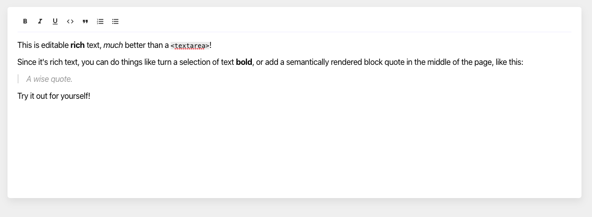

# Rich Text Editor

A beautiful and simple Rich Text Editor made in React. Just it.

This project was bootstrapped with [Create React App](https://github.com/facebook/create-react-app).

## Prerequisites

To make this project I used the following liberies: 

- react 16.12
- react-icons-kit 1.3.1
- slate 0.57.1
- slate-react 0.57.1

## Available Scripts

In the project directory, you can run:

### `yarn start`

Runs the app in the development mode. 
Open [http://localhost:3000](http://localhost:3000) to view it in the browser.

The page will reload if you make edits. 
You will also see any lint errors in the console.

### `yarn test`

Launches the test runner in the interactive watch mode. 
See the section about [running tests](https://facebook.github.io/create-react-app/docs/running-tests) for more information.

### `yarn build`

Builds the app for production to the `build` folder. 
It correctly bundles React in production mode and optimizes the build for the best performance.

The build is minified and the filenames include the hashes. 
